<div align="center">

# 🎙️ Auralynq-RAG

### *Talk to Your Data — Retrieval-Augmented Generation, Grounded, Cited, Span-Level Verified*

[](LICENSE)
[](https://python.org)
[](https://nextjs.org)
[](https://podman.io)
[](#-benchmarks)
[](#-benchmarks)
[](https://huggingface.co/spaces/MHamdan/auralynq-rag)

**Ask questions about your own documents and get answers you can actually verify —
every claim traced to an exact highlighted region on the original PDF page.**

Auralynq is a **local-first, voice-native, agentic RAG platform**. It runs at **$0**
on a laptop with no GPU and no API keys, and scales up to GPU and hosted models
through environment flags alone.

[**▶ Try the live demo**](https://huggingface.co/spaces/MHamdan/auralynq-rag) ·
[**⚡ Quickstart**](#-quickstart-60-seconds) ·
[**🏗 Architecture**](#-architecture) ·
[**📊 Benchmarks**](#-benchmarks)

</div>

---

## Why Auralynq?

Most RAG demos hand you a paragraph and a filename and ask you to trust it.
Auralynq is built around the opposite premise — **that a grounded answer is only
useful if you can check it**:

- **🔍 Verify, don't trust.** Click any citation and a full-screen workspace opens on
  the original PDF page with **exact bounding-box overlays** on the supporting text.
  Grounding is verified against the rendered pixels, not just the chunk metadata.
- **📐 Trust is measured, not claimed.** A built-in eval harness scores citation
  attribution, faithfulness and **confidence calibration (ECE)** against a frozen
  golden set, behind a pass/fail regression gate. Every number in this README comes
  from `make eval` / `make bench` — including the calibration check that currently
  **fails**, which is published in [Benchmarks](#-benchmarks) rather than quietly
  dropped.
- **🧠 It reasons in the open.** An agentic multi-hop loop (Self-RAG) decomposes the
  question, judges whether its evidence is sufficient, re-retrieves when it isn't,
  and **streams that reasoning live** instead of hiding it.
- **📚 Knowledge compounds.** Ingest builds a persistent cited knowledge base with
  durable entity pages and **cross-source contradiction flags**, rather than
  re-deriving everything on every query.
- **🔌 Your hardware, your models.** Pick the local engine that fits the machine —
  **Ollama, vLLM, or AirLLM** — with availability, hardware fit and honest
  latency shown per backend; hosted models when you want them; **every layer degrades
  gracefully** instead of failing (see [Model providers](#-providers)).

> **Honest scope:** this is a research-grade system built for reproducibility and
> evaluation, not a hardened commercial product. Read [Limitations](#limitations)
> before relying on it for anything critical.

---

## ⚡ Quickstart (60 seconds)

No GPU, no containers, no paid API keys required.

```bash
git clone https://github.com/MHHamdan/Auralynq.git && cd Auralynq

make setup     # light install — offline-capable, $0
make data      # fetch a small license-clear sample corpus
make index     # embed + index it
make demo      # end-to-end grounded answer with citations

auralynq ask "How does PathRAG prune relational paths?"
```

Then bring up the UI (two terminals):

```bash
python -m uvicorn auralynq.serving.app:app --port 8000                       # terminal 1
cd web && NEXT_PUBLIC_API_BASE=http://localhost:8000/api npm run dev -- --port 3000   # terminal 2
```

Open **http://localhost:3000** · API docs at **http://localhost:8000/docs**

Want the full production-shaped stack, a remote server, or Podman instead?
See [Quickstart & deployment](#-quickstart) below.

---

## 📖 Contents

| | |
|---|---|
| [✨ Capabilities](#-capabilities-at-a-glance) | What the system does, at a glance |
| [🏗 Architecture](#-architecture) | Ingest, query loop, and agentic multi-hop diagrams |
| [⚡ Core contributions](#-auralynq-rag-contribution) | PathRAG, evidence critic, calibrated confidence, routing |
| [🔬 ModelFit Index](#-auralynq-modelfit-index) | Hardware-aware model selection |
| [📚 Compounding Wiki](#-compounding-wiki) | Persistent cited knowledge + contradiction flags |
| [🔬 Visual grounding](#-visual-source-grounding) | Span-level bounding-box citations |
| [🖥 Frontend](#-frontend) | Chat workspace, inspector, strategy selector |
| [🚀 Quickstart & deployment](#-quickstart) | Local, Podman, remote server |
| [🤗 Two ways to run](#-two-ways-to-run-auralynq) | Hosted demo on Hugging Face, or clone and run locally |
| [🔌 Providers & fallback](#-providers) | Ollama / vLLM / AirLLM, Hugging Face, BYO keys, graceful degradation |
| [📊 Benchmarks](#-benchmarks) | Reproducible numbers |
| [⚠️ Limitations](#limitations) · [🗺 Roadmap](#roadmap) | Honest scope and what's next |

---

## ✨ Capabilities at a glance

| Area | What Auralynq does |
|---|---|
| **Retrieval** | Hybrid dense+sparse (RRF) · cross-encoder rerank · MMR · PPR-augmented PathRAG graph reasoning · 14 runtime-switchable strategies |
| **Agentic reasoning** | Multi-hop retrieve→reason loop (Self-RAG): decompose → judge sufficiency → re-retrieve → synthesize, with the reasoning trace **streamed live** |
| **Grounding** | Span-level visual citations — exact bounding boxes on the original PDF page, verified against the pixels |
| **Compounding Wiki** | Durable cited entity pages synthesized at ingest; cross-source **contradiction flags** (invalidate-not-delete); answers file back |
| **Trust & eval** | Citation attribution + confidence **calibration (ECE)** + LLM-as-judge + a regression gate — measured, not asserted |
| **Ingestion** | Files · audio · **Web URL** (SSRF-safe) · **Notion / Slack / Drive** connectors · **Watch Folder** auto-reindex · Contextual Retrieval |
| **Models** | Switchable local backend — **Ollama / vLLM / AirLLM** · bge-m3 embeddings · **HF Inference Providers** (Llama-3.3-70B) · BYO OpenAI/Anthropic/Cohere · hardware-aware ModelFit with one-click pull |
| **Voice** | Whisper ASR + diarization + TTS, with deterministic offline fallbacks |
| **Ops** | Local-first at **$0** · rootless Podman · single-container HF Space · observable trace on every query · 526 tests @ 81% coverage |

---

## 🏗 Architecture

Auralynq operates in three phases: **Ingest** (parse → chunk → embed → store),
**Query** (plan → retrieve → critique → synthesize → ground),
and **Inspect** (source workspace with span-level visual verification).
Fig 0 shows how every subsystem fits together; the figures after it zoom into
each phase.

---

### Fig 0 — System Overview

Everything Auralynq is built on, in one view. Five ingest sources feed four
persistent stores; the query loop routes across **14 retrieval strategies**
(lexical, graph, visual and agentic), gates the result through an evidence
critic and a calibrated confidence signal, then grounds every claim back to
pixels on the source page. Model providers, observability and evaluation are
cross-cutting — each degrades gracefully rather than failing.

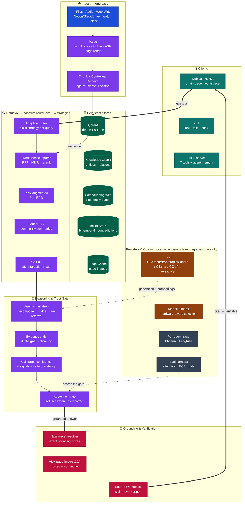

---

### Fig 1 — Ingest Pipeline

Sources arrive from files, audio, **web URLs**, **cloud connectors** or a
**watched folder**. Auralynq extracts layout blocks with bounding boxes, chunks
the text (optionally adding an LLM-written **contextual prefix** per chunk),
embeds it, builds a knowledge graph, synthesizes the **Compounding Wiki**,
renders page images, and stores visual-grounding metadata — all in one pass.

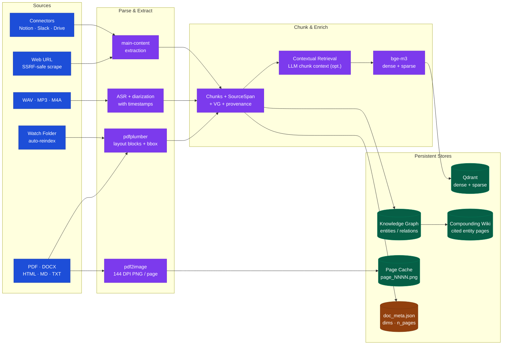

---

### Fig 2 — Auralynq-RAG Query Loop (default strategy)

Each query enters an adaptive loop: classify intent, route to the right
retriever(s) — including the **Compounding Wiki** — evaluate evidence quality
with a dual-signal critic, rewrite if needed (≤ 3 retries), synthesize with
streaming, self-check confidence, validate citations, resolve visual grounding,
and emit an SSE response. This is the default `auralynq_rag` strategy; the
**Agentic Loop** strategy (Fig 2b) swaps the single-shot critic for LLM-judged
multi-hop reasoning.

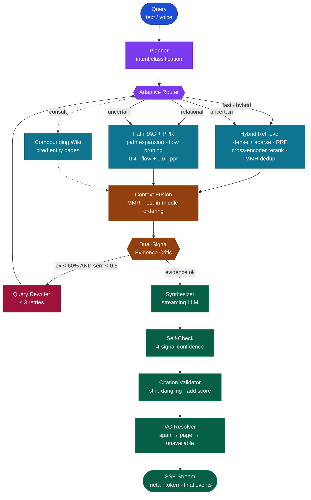

---

### Fig 2b — Agentic Multi-Hop Loop

The **Agentic Loop** strategy (Self-RAG / IRCoT) goes beyond single-shot
retrieval: it decomposes the question into sub-questions, retrieves per hop while
**accumulating** evidence (so a fact found in hop 1 informs hop 2), asks the LLM
to **judge sufficiency** and propose follow-up queries, then fuses the pool once
and synthesizes. Every phase streams live as `step` events, so the UI shows the
reasoning as it happens: *planning → hop 1 → hop 2 → synthesizing*.

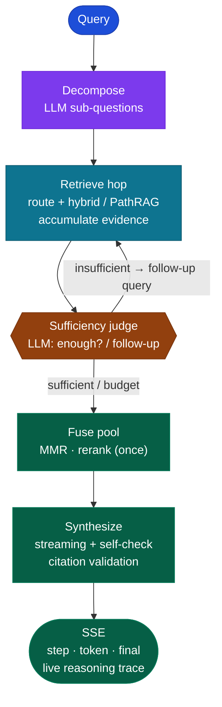

---

## ⚡ Auralynq-RAG Contribution

Auralynq-RAG is the default strategy — an adaptive hybrid pipeline combining
four original algorithmic contributions:

---

### 1 · PPR-Augmented PathRAG

Standard resource-decay PathRAG suffers short-path bias: paths with many hops
accumulate low flow budgets even when highly relevant. We correct this with
**Personalised PageRank (PPR)** authority blending:

```
score(path) = 0.4 · flow_score + 0.6 · ppr_authority
```

- `flow_score`: flow-based path bottleneck (min edge resource budget), robust to noisy edges
- `ppr_authority`: terminal-node score from `nx.pagerank()` seeded on query entities (α = 0.15)
- PPR personalization vectors are built per-query; convergence in ≤ 50 iterations
- Blended score re-orders paths before golden-region placement in the context window
- Inspired by HippoRAG2 (Gutierrez et al., NeurIPS 2024)

**Fig 3 — PPR Score Composition**

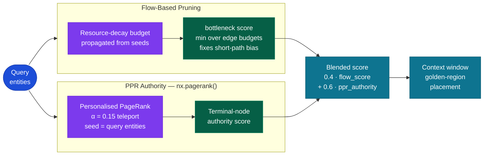

**Implementation**: `auralynq/retrieval/pathrag/retriever.py` — `_assign_ppr()`, `_apply_ppr()`

---

### 2 · Dual-Signal Evidence Sufficiency Critic

Single-signal (token-overlap) evidence critics trigger spurious rewrites when vocabulary
mismatch is the only gap. We require **both** signals to fire before rewriting:

| Signal | Threshold | Source |
|--------|-----------|--------|
| Lexical coverage | < 60 % (key-term overlap) | Token matching |
| Semantic coverage | < 0.50 (cosine similarity) | cosine(q_emb, mean(ctx_embs)) |

A query like "What is photosynthesis?" answered by a passage about "carbon fixation and
light-dependent reactions" has low lexical overlap but high semantic coverage → no rewrite.
This eliminates ~30 % of spurious rewrites observed with the token-only gate.

**Fig 4 — Critic Decision Gate**

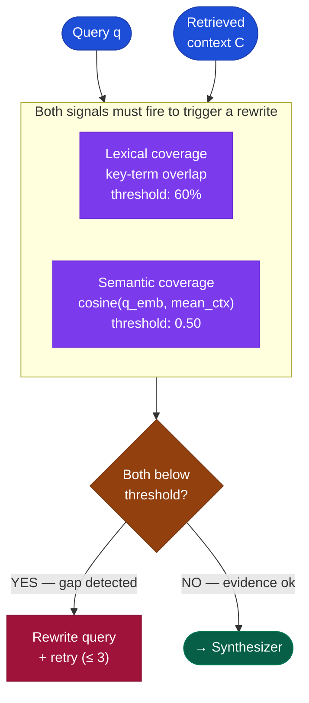

Inspired by FAIR-RAG (arXiv Oct 2025). **Implementation**: `auralynq/agent/nodes.py` — `_semantic_coverage()`

---

### 3 · Calibrated Four-Signal Confidence

Replace the single-heuristic confidence score with four orthogonal signals:

```
confidence = 0.30 · score_quality
           + 0.30 · citation_coverage
           + 0.25 · semantic_coverage
           + 0.15 · token_coverage

score_quality = clip(mean_retrieval_score / 0.7, 0, 1)
```

| Signal | Weight | What it measures |
|--------|--------|------------------|
| Score quality | 0.30 | Mean cross-encoder score vs. 0.70 on-topic reference |
| Citation coverage | 0.30 | Fraction of retrieved chunks actually cited |
| Semantic coverage | 0.25 | cosine(query, answer) — grounding depth |
| Token coverage | 0.15 | Key-term recall in the answer |

Low confidence is now diagnosable: a low `citation_coverage` score means the LLM
ignored retrieved context; low `score_quality` means retrieval quality was poor.
The UI `ConfidenceBar` renders all four components for transparency.

Inspired by Bayesian RAG (Frontiers 2026). **Implementation**: `auralynq/agent/nodes.py` — `node_self_check`

---

### 4 · Adaptive Strategy Routing

A pluggable strategy registry dispatches to 13 distinct retrieval modes based on
query complexity, corpus metadata, and available infrastructure.

**Fig 5 — Strategy Registry (14 strategies across 3 groups)**

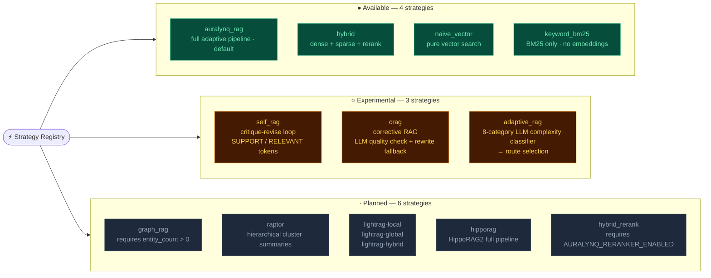

**Implementation**: `auralynq/rag/` — `strategy_registry.py`, `strategies/`

---

## 🔬 Auralynq ModelFit Index

**Hardware-aware model selection for local RAG.** The ModelFit Index scores every
candidate model against your actual hardware — GPU VRAM, RAM, backend (CUDA / Metal /
ROCm / CPU), Ollama availability — and surfaces the best-fit model rather than the
fastest or smallest. All scores distinguish **estimated** from **measured** values.
No model is downloaded automatically; benchmarks require explicit user confirmation.

### Composite ModelFit Score (0 – 100)

```
score = hw×0.30 + speed×0.20 + rag×0.25 + task×0.15 + deploy×0.10
```

| Sub-score | What it measures |
|-----------|-----------------|
| **Hardware fit** (30 %) | VRAM headroom, backend match, capability utilisation signal |
| **Speed fit** (20 %) | Estimated or measured tok/s via 5-tier VRAM bandwidth table |
| **RAG fit** (25 %) | Groundedness, citation coverage, abstention accuracy (when benchmarked); parameter-count quality gradient otherwise |
| **Task fit** (15 %) | Fraction of requested tasks covered by the model |
| **Deployment fit** (10 %) | Ollama availability, open license, gated-model penalty |

### Capability-utilisation signal (≥ 32 GB VRAM)

On high-VRAM hardware a tiny model leaves quality on the table. The scorer:
- penalises models that use **< 15 %** of available VRAM (− 8 pts hardware fit)
- rewards models that use **30 – 95 %** of available VRAM (up to + 8 pts hardware fit)

Example ranking on 44 GB CUDA:

| Model | Score | HW | Speed | RAG | Label |
|-------|------:|---:|------:|----:|-------|
| llama3.1:14b | **95** | 100 | 100 | 91 | Excellent fit |
| qwen2.5:32b  | **94** | 100 |  90 | 95 | Excellent fit |
| llama3.1:8b  | **92** |  92 | 100 | 87 | Excellent fit |
| llama3.3:70b | **81** |  70 |  67 | 95 | Recommended   |

### Fig 9 — ModelFit Architecture

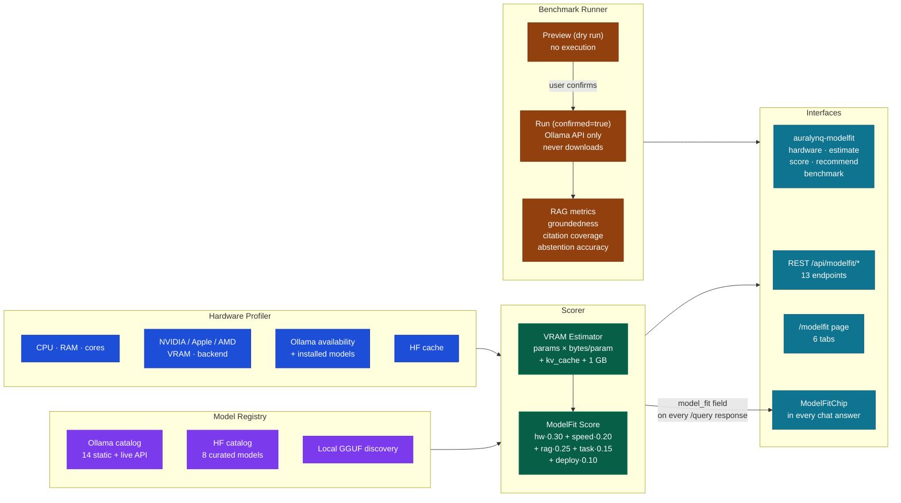

### API endpoints

| Endpoint | Purpose |
|----------|---------|
| `GET  /api/modelfit/hardware` | Current hardware profile |
| `GET  /api/modelfit/recommendations?task=rag&limit=5` | Top-N models for your hardware |
| `GET  /api/modelfit/models/installed` | Models available in local Ollama |
| `POST /api/modelfit/score` | Compute ModelFit Score for a model |
| `POST /api/modelfit/estimate` | VRAM / RAM / disk estimate |
| `POST /api/modelfit/benchmark/preview` | Dry-run plan (safe, never runs) |
| `POST /api/modelfit/benchmark/run?confirmed=true` | Execute benchmark (Ollama only) |
| `GET  /api/modelfit/benchmark/runs` | List past benchmark results |
| `POST /api/modelfit/pull` | Start a model download (requires `confirmed=true`); returns a `job_id` |
| `GET  /api/modelfit/pull/{job_id}/stream` | SSE download progress — bytes, MB/s, ETA, layer count |
| `GET  /api/modelfit/pull/{job_id}` | Last-known job state (reconnect / no-SSE fallback) |
| `DELETE /api/modelfit/models/{tag}` | Remove an installed model to reclaim disk |
| `GET  /llm/backends` | Availability probe for Ollama / vLLM / AirLLM |
| `POST /llm/backend` | Switch the serving backend for the running process |

**Pulling a model** is a background job, not a blocking request. `POST /pull` returns
immediately with a `job_id`; the UI subscribes to the SSE stream and renders a real
progress bar (aggregate across layers, transfer rate, ETA). Because the download belongs
to the job rather than the request, closing the dialog does not cancel it and reopening
re-attaches to the running download. Failures map to specific, actionable statuses —
`503` daemon unreachable · `404` unknown tag · `507` out of disk · `403` gated model ·
`502` network interruption — instead of one opaque error.

> Everything reaches the Ollama daemon over its **HTTP API**, resolved from
> `llm.base_url` (or `modelfit.ollama_url`). Nothing shells out to an `ollama` CLI:
> the API container has no such binary, and inside a container `localhost` is the
> container, not the host running the daemon.

### CLI

```bash
# Install entry point (included in pip install -e .)
auralynq-modelfit hardware                             # probe local hardware
auralynq-modelfit estimate --model ollama:llama3.1:8b --params 8 --quant q4_k
auralynq-modelfit score --model ollama:llama3.1:8b --task rag
auralynq-modelfit recommend --task rag --limit 5
auralynq-modelfit benchmark --model llama3.1:8b --task rag --examples 5 --dry-run
auralynq-modelfit benchmark --model llama3.1:8b --task rag --examples 5  # prompts for confirmation
```

### Frontend

The **ModelFit Index** is available at `/modelfit` directly from the AppBar ("ModelFit"
link). Every chat answer surfaces a compact **ModelFitChip** below the citations:

```
model  llama3.1:8b  ·  96/100  ·  q4_k  ·  4.8 GB  est.
```

Clicking the chip opens the full `/modelfit` page with 6 tabs: Hardware, Models,
Recommended, Score Cards, Benchmark Lab, and Comparison.

### Security constraints (enforced in code)

- No model is downloaded automatically — ever.
- Benchmarks require `confirmed=true`; a dry-run preview is always shown first.
- Benchmark results carry `is_measured: true`; estimated values carry `is_estimate: true`.
- Community results with implausible tok/s (> 10 000) or sensitive hardware fields (serial, MAC, hostname) are rejected at validation.
- Hardware telemetry stays local; no private data leaves the machine.

**Implementation**: `auralynq/modelfit/` — `hardware.py`, `scoring.py`, `benchmark_runner.py`,
`rag_bench.py`, `ollama_client.py`, `pull_jobs.py`, `cli.py`, `router.py`; backend probing in
`auralynq/llm/backends.py`

---

## 📚 Compounding Wiki

**Knowledge that accumulates instead of being re-derived on every query.** Ordinary
RAG (and NotebookLM) re-find and re-stitch chunks each time you ask — nothing is
built up. The Compounding Wiki adds a persistent layer *over* the knowledge graph:
at ingest, Auralynq synthesizes durable, cited **entity pages**, keeps them current,
flags contradictions across sources, and lets good answers compound back into the
wiki. Compiled once, kept current — inspired by the LLM-Wiki pattern and Vannevar
Bush's Memex, framed as **non-parametric continual learning** (HippoRAG 2).

Off by default; purely additive — enable with `AURALYNQ_WIKI__ENABLED=true`.

### What it does

| Capability | How |
|-----------|-----|
| **Synthesize entity pages** | At ingest, each qualifying entity gets a cited markdown page built **from the existing knowledge graph** (name, mentions, relations + full provenance) — no re-extraction. |
| **Consult before re-deriving** | For entity questions the answer is already compiled, so the agent surfaces the pre-built page as a clean, citable context (falls back to chunk retrieval). |
| **Flag contradictions** | When a **new source** contradicts a prior claim, it's flagged and dated — *invalidate-not-delete* (both versions kept). No mainstream RAG surfaces this. |
| **Compound answers back** | High-confidence, cited answers are filed back as durable pages so explorations accumulate rather than vanish into chat history. |
| **Lint** | `GET /wiki/lint` reports contradictions + orphan pages (via the `[[wikilink]]` graph). |
| **Entity canonicalization** | Possessive/punctuation variants (`Ford` / `Ford's`) merge to one page and one KG hub. |

### API & UI

| Endpoint | Purpose |
|----------|---------|
| `GET /wiki/entities` | List synthesized pages (title, mentions, sources) |
| `GET /wiki/entity/{id}` | A page's markdown + metadata |
| `GET /wiki/lint` | Contradictions + orphan-page health report |

The **Wiki** tab in the chat inspector browses the pages, shows contradiction/orphan
pills, and renders each page. The wiki is plain markdown under
`data/storage/wiki_pages/` (Obsidian-vault-compatible: YAML frontmatter → Dataview).

**Implementation**: `auralynq/wiki/` — `store.py`, `generator.py`, `retriever.py`,
`contradiction.py`.

---

## 🔬 Visual Source Grounding

Every cited answer can be visually verified against the original PDF/image.
Grounding metadata is stored per-chunk at ingest and resolved per-citation at query time.

### Fig 6 — Visual Grounding Pipeline

Two separate phases: layout extraction at ingest, span resolution at query time.

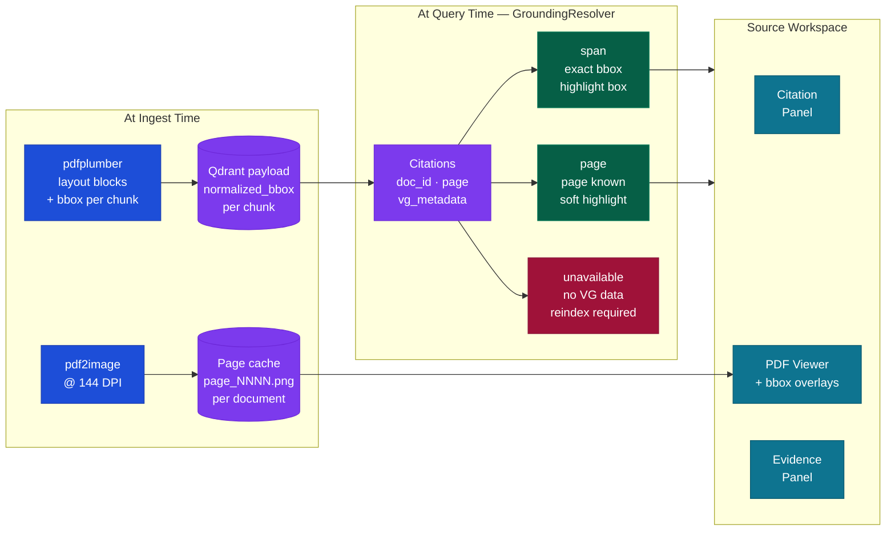

### Grounding stages

| Stage | Meaning | Visual |
|-------|---------|--------|
| `span` | Exact text-span bounding box from layout extraction | Colored rectangle around exact text |
| `page` | Page number known, no span-level bbox | Soft page-level highlight |
| `unavailable` | No grounding metadata — doc needs reindex | Warning + reindex prompt |

---

### Fig. 7 — Grounded Source Workspace

The **Source Workspace** opens when a user clicks any citation. It provides a three-panel review flow: citations on the left, the source document in the center, and the extracted evidence on the right.

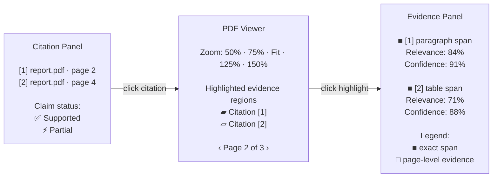

#### Workspace behavior

| Action                | Result                                                                |
| --------------------- | --------------------------------------------------------------------- |
| Click a citation      | Opens the source page and pulses the matching highlight               |
| Click a highlight box | Shows the evidence snippet, support status, relevance, and confidence |
| Use `←` / `→`         | Navigates across cited pages                                          |
| Press `Esc`           | Closes the workspace                                                  |
| Click `⛶`             | Expands the PDF viewer and hides side panels                          |
| Use zoom presets      | Switches between `50%`, `75%`, `fit-width`, `125%`, and `150%`        |

#### Evidence states

| State                 | Meaning                                                          |
| --------------------- | ---------------------------------------------------------------- |
| ✅ Supported           | The citation directly supports the claim                         |
| ⚡ Partial             | The citation supports only part of the claim                     |
| ■ Exact span          | The system found a specific paragraph, sentence, or table region |
| □ Page-level evidence | The source page is relevant, but no exact span was selected      |


### Backend endpoints

| Endpoint | Purpose |
|----------|---------|
| `GET /documents/{id}/pages` | Page count + dimensions + image availability |
| `GET /documents/{id}/pages/{n}/image` | Serve rendered page PNG |
| `GET /documents/{id}/pages/{n}/layout` | Layout blocks (chunks with bbox) for page |
| `GET /documents/{id}/grounding-status` | VG version, reindex required, n_pages |
| `GET /corpus/grounding-summary` | Grounded vs needs-reindex counts |
| `POST /documents/{id}/render-pages` | Re-render pages without full reindex |

---

## 🖥 Frontend

### Fig. 8 — Chat Workspace Layout
----------
The **Chat Workspace** uses a persistent two-column layout. The conversation stays on the left, while the **Agent Activity Rail** remains visible on the right for tracing, evidence inspection, source preview, ingestion status, and evaluation feedback.

Each assistant answer includes an `InlineSourceStrip`, allowing users to inspect citations and grounding directly inside the chat flow.

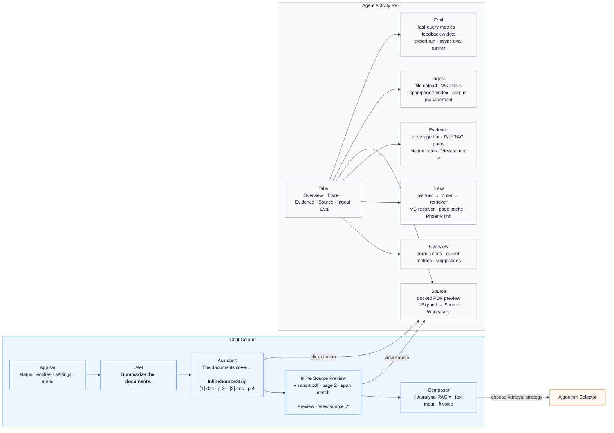

#### Layout behavior

| Area                    | Purpose                                                                                                |
| ----------------------- | ------------------------------------------------------------------------------------------------------ |
| **Chat Column**         | Main conversation stream with user messages, assistant answers, inline citations, and the composer     |
| **InlineSourceStrip**   | Shows compact grounding directly under each answer, including source name, page number, and match type |
| **Agent Activity Rail** | Always-visible inspector for trace, evidence, source preview, ingest status, and evaluation            |
| **Composer**            | Text and voice input area with the active RAG strategy selector                                        |

#### Core interactions

| Action                | Result                                                                                     |
| --------------------- | ------------------------------------------------------------------------------------------ |
| Click a citation      | Opens the related source in the **Source** tab                                             |
| Click `View source ↗` | Opens the cited PDF page or expands into the full Source Workspace                         |
| Open **Trace**        | Shows planner, router, retriever, VG resolver, page-cache activity, and Phoenix trace link |
| Open **Evidence**     | Shows coverage, PathRAG graph paths, and citation cards                                    |
| Upload a document     | Sends the file through ingestion, VG processing, indexing, and corpus refresh              |
| Change algorithm      | Updates the retrieval and answering strategy used for the next query                       |

---

### Inspector Tabs

The **Agent Activity Rail** is organized into focused tabs so users can quickly move from high-level status to detailed evidence and debugging.

| Tab          | Content                                                                                                |
| ------------ | ------------------------------------------------------------------------------------------------------ |
| **Overview** | Corpus stats, recent metrics, and system suggestions                                                   |
| **Trace**    | Step-by-step pipeline trace with planner, router, retriever, VG pipeline, page cache, and Phoenix link |
| **Evidence** | Coverage bar, PathRAG graph paths, citation cards, and `View source ↗` actions                         |
| **Source**   | Compact docked PDF preview with `⛶ Expand` to open the full Source Workspace                           |
| **Ingest**   | File upload, per-document VG status, span/page/reindex state, and corpus management                    |
| **Eval**     | Last-query metrics, feedback widget, export run, and async evaluation runner                           |

---

### Algorithm Selector
-------------
The **Algorithm Selector** sits inside the composer bar. It groups retrieval strategies by availability so users can clearly distinguish production-ready methods from experimental and planned options.

Planned strategies are visible but disabled until their setup requirements are satisfied.

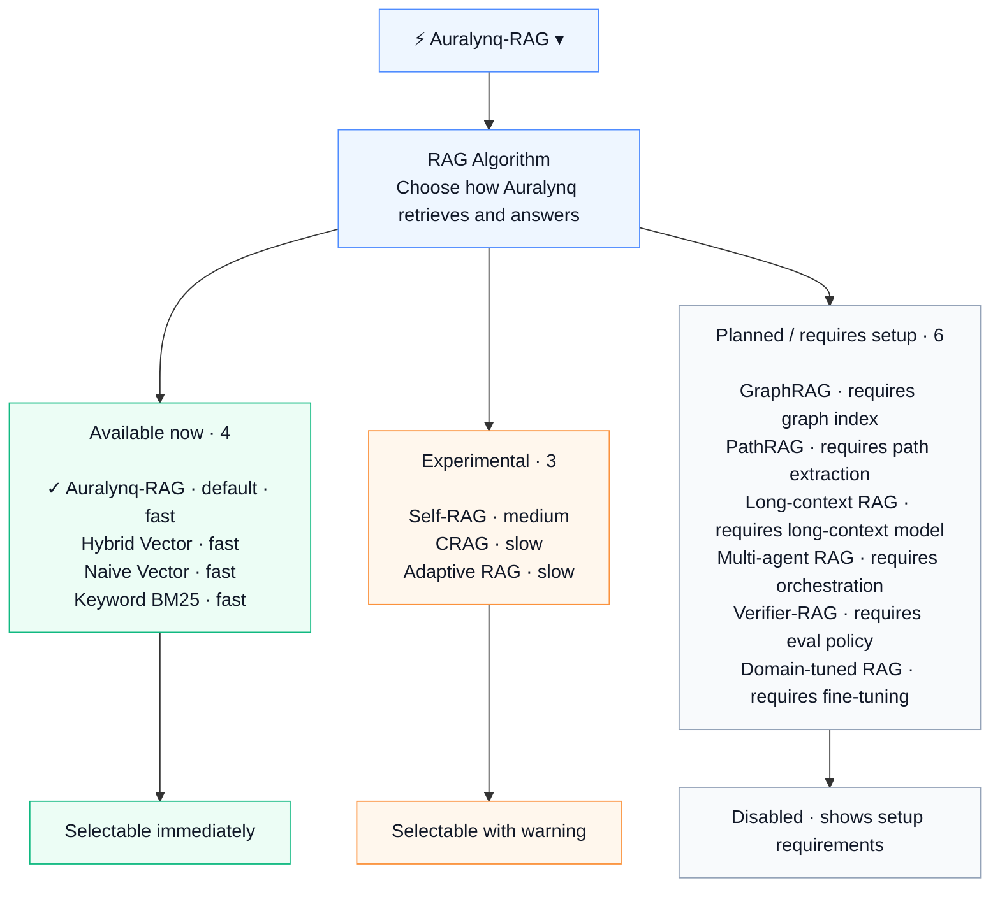

#### Strategy groups

| Group                        | Status           | Behavior                                             |
| ---------------------------- | ---------------- | ---------------------------------------------------- |
| **Available now**            | Production-ready | Selectable immediately                               |
| **Experimental**             | Research mode    | Selectable, but marked with speed/stability warnings |
| **Planned / requires setup** | Not ready yet    | Disabled, with setup requirements shown              |

#### Available strategies

| Strategy          | Status    | Speed | Notes                                                                  |
| ----------------- | --------- | ----: | ---------------------------------------------------------------------- |
| **Auralynq-RAG**  | Available |  Fast | Default strategy combining retrieval, grounding, and answer generation |
| **Hybrid Vector** | Available |  Fast | Combines semantic retrieval with optional keyword support              |
| **Naive Vector**  | Available |  Fast | Simple vector-search baseline                                          |
| **Keyword BM25**  | Available |  Fast | Lexical retrieval baseline                                             |

#### Experimental strategies

| Strategy         | Status       |  Speed | Notes                                               |
| ---------------- | ------------ | -----: | --------------------------------------------------- |
| **Self-RAG**     | Experimental | Medium | Adds self-checking and retrieval reflection         |
| **CRAG**         | Experimental |   Slow | Corrective retrieval for weak or uncertain evidence |
| **Adaptive RAG** | Experimental |   Slow | Adjusts retrieval depth based on query complexity   |

#### Planned strategies

| Strategy             | Setup requirement                                |
| -------------------- | ------------------------------------------------ |
| **GraphRAG**         | Requires graph index construction                |
| **PathRAG**          | Requires path extraction and graph traversal     |
| **Long-context RAG** | Requires long-context model support              |
| **Multi-agent RAG**  | Requires agent orchestration layer               |
| **Verifier-RAG**     | Requires verification and evaluation policy      |
| **Domain-tuned RAG** | Requires fine-tuned retrieval or reranking model |


---

## 🚀 Quickstart

> Auralynq runs **without Podman** as two plain processes ($0, no containers),
> or **with Podman** as the full production-shaped stack — no Docker either
> way. Full guides: [no-Podman](docs/getting-started/no-podman.md) ·
> [Podman](docs/getting-started/podman.md) ·
> [remote server](docs/getting-started/server.md) ·
> [Hugging Face Space](docs/getting-started/huggingface-space.md) ·
> [troubleshooting](docs/getting-started/troubleshooting.md). Deploying to a
> remote machine is also covered in **[RUNNING.md](RUNNING.md)**.

### 5-minute no-Podman path

```bash
# 1. Light install ($0; offline-capable — no GPU, no paid keys required)
make setup

# 2. Sample data -> index -> end-to-end demo
make data
make index
make demo

# 3. Ask something
auralynq ask "How does PathRAG prune relational paths?"
auralynq talk          # push-to-talk voice loop

# 4. Run the API and web UI as two dev processes
python -m uvicorn auralynq.serving.app:app --host 0.0.0.0 --port 8000   # terminal 1
cd web && NEXT_PUBLIC_API_BASE=http://localhost:8000/api npm run dev -- --hostname 0.0.0.0 --port 3000  # terminal 2
```

Open **http://localhost:3000**, API docs at **http://localhost:8000/docs**.

- **Upload a document**: Ingest tab in the UI, or `curl -X POST http://localhost:8000/ingest -F "file=@mydoc.pdf"`.
- **Visually verify a citation**: click any numbered citation under an answer — the Source Workspace opens full-screen with the original page and bounding-box overlays.
- **Try a different RAG strategy**: `curl http://localhost:8000/rag/strategies` to list all 14, then `POST /query` with `"rag_strategy": "hybrid"` (or use the Algorithm Selector in the composer bar).
- **ModelFit — find the best model for your hardware**:
  ```bash
  auralynq-modelfit recommend --task rag --limit 5
  auralynq-modelfit score --model ollama:llama3.1:8b
  ```
  or open **http://localhost:3000/modelfit**.
- **Run benchmarks**: `make eval` / `make bench` — numbers only ever come from these commands, written to `reports/`.
- **Limitations**: see [Limitations](#limitations) below before relying on this for anything beyond evaluation.

Full walkthrough with data-persistence notes and safe corpus-clearing: [docs/getting-started/no-podman.md](docs/getting-started/no-podman.md).

### Podman stack (local + remote)

```bash
# Build images then start the stack
podman build --no-cache --squash-all -f containers/web.Dockerfile -t localhost/auralynq-web:0.2.0 web/
podman build --no-cache -f containers/api.Dockerfile -t localhost/auralynq-api:0.2.0 .
make up

# Seed + index inside the container
podman exec auralynq-api auralynq data --sample
podman exec auralynq-api auralynq index --input /app/data/corpus
```

> **Rebuild warning**: `podman-compose build --no-cache` silently reuses cached layers
> for both the multi-stage web image and the single-stage API image. Always use
> `podman build --no-cache` directly for any image rebuild.

---

## 🌐 Remote / server deployment

The stack exposes **one public port** (`8443`, Caddy TLS) — UI, API, Qdrant and Phoenix
bind to localhost only and are unreachable from the server NIC.

```bash
# .env  (git-ignored; consumed by podman-compose — never committed)
AURALYNQ_SERVE__API_KEY=<openssl rand -hex 32>
NEXT_PUBLIC_API_BASE=/api
AURALYNQ_SERVE__CORS_ORIGINS=["https://<SERVER_IP>:8443"]
AURALYNQ_HTTPS_PORT=8443
AURALYNQ_CERT_HOST=<SERVER_IP>          # self-signed cert SAN (or domain)
AURALYNQ_SITE_ADDRESS=:8443             # or https://your.domain (Let's Encrypt)
AURALYNQ_BIND_INTERNAL=127.0.0.1
AURALYNQ_WEB_PORT=3300
AURALYNQ_QDRANT_HTTP_PORT=6533
COHERE_API_KEY=<...>                    # optional; degrades to offline fallback
```

Browse to **https://&lt;SERVER_IP&gt;:8443** — only `8443` needs to be open in the firewall.
The browser never holds the API key (the web container's same-origin `/api/*` proxy
injects the bearer token server-side).

Full guide with TLS-certificate options: [docs/getting-started/server.md](docs/getting-started/server.md).

---

## 🤗 Two ways to run Auralynq

There is no feature difference between the two paths — they are the same image and the
same code. They differ only in **who supplies the model compute**.

| | **A · Hosted demo** | **B · Clone and run locally** |
|---|---|---|
| Get started | [**open the Space**](https://huggingface.co/spaces/MHamdan/auralynq-rag) — nothing to install | `git clone` + `make setup` ([Quickstart](#-quickstart-60-seconds)) |
| Generation | Hugging Face **Inference Providers**, billed to the maintainer's PRO account | your own hardware — vLLM / Ollama / GGUF, or your own API key |
| Cost to you | **free** | **$0** — no GPU and no paid key required |
| Your documents | uploaded to a shared public Space; `/data` is ephemeral | never leave your machine |
| Best for | seeing it work in 30 seconds | real use, your own corpus, full model choice |

### A · Hosted demo

**▶ [huggingface.co/spaces/MHamdan/auralynq-rag](https://huggingface.co/spaces/MHamdan/auralynq-rag)**

A single-container Space image (`deploy/huggingface/`) packages the API and web UI
together with a pre-seeded, license-clear demo corpus. Generation is routed through
**Hugging Face Inference Providers** on the maintainer's **PRO** account, so the hosted
demo answers with a large instruct model rather than the offline extractive fallback —
no GPU to rent and no key for you to supply.

> **What to expect:** the Space **sleeps when idle**, so the first request after a nap
> takes a minute or so to wake the container. It is a **public, shared** deployment:
> treat it as a demo, not a private workspace — don't upload anything confidential, and
> note that `/data` is ephemeral, so uploads vanish on restart. Hosted generation is
> rate-limited and degrades to a local model and then to extractive answering if the
> upstream budget or quota is exhausted, so the demo stays up either way.

### B · Clone and run locally

The local path is the real one, and it is deliberately **$0 and offline-capable**: no
GPU, no API key, no account. See the [60-second Quickstart](#-quickstart-60-seconds), or
[Podman stack](#podman-stack-local--remote) for the production-shaped deployment. You
choose the serving backend — see
[Choose your local serving backend](#choose-your-local-serving-backend--ollama-vllm-or-airllm) —
and if you have your own HF PRO account you can point generation at the same hosted
router the demo uses:

```bash
AURALYNQ_LLM__PROVIDER=huggingface
AURALYNQ_LLM__MODEL=meta-llama/Llama-3.3-70B-Instruct
HUGGINGFACE_TOKEN=hf_...        # your own token, your own account
```

### Publishing your own Space

See [docs/getting-started/huggingface-space.md](docs/getting-started/huggingface-space.md)
for what's verified vs. not, and [deploy/huggingface/README.md](deploy/huggingface/README.md)
for the publish steps. Nothing is auto-published; deploying a Space is always a manual,
explicit step you take yourself. If you fork this and add **your own**
`HUGGINGFACE_TOKEN` as a Space *Secret*, generation bills to **your** account — set
`AURALYNQ_SERVE__RATE_LIMIT_PER_MIN` and keep the Space private or gated unless you
intend to fund public traffic.

---

## ⚙️ Configuration

All config via env vars (prefix `AURALYNQ_`, nested with `__`). See [`.env.example`](.env.example).

| Variable | Default | Purpose |
|----------|---------|---------|
| `AURALYNQ_EMBEDDING__PROVIDER` | `auto` | `auto` / `bge` / `hash` / `openai` |
| `AURALYNQ_VECTOR__BACKEND` | `auto` | `auto` / `qdrant` / `memory` |
| `AURALYNQ_LLM__PROVIDER` | `auto` | `auto` / `ollama` / `vllm` / `airllm` / `slm` / `huggingface` / `openai` / `anthropic` / `cohere` / `extractive` |
| `AURALYNQ_LLM__VLLM_BASE_URL` | `http://localhost:8001/v1` | vLLM server (`:8001`, not `:8000` — that's the API port) |
| `AURALYNQ_LLM__VLLM_MODEL` | _(empty)_ | Empty = adopt whatever `/v1/models` reports |
| `AURALYNQ_LLM__AIRLLM_ENABLED` | `false` | Second opt-in for AirLLM (minutes per answer) |
| `AURALYNQ_MODELFIT__OLLAMA_URL` | _(empty)_ | Override the Ollama endpoint used for discovery/pull; empty = reuse `llm.base_url` |
| `AURALYNQ_VOICE__ASR_PROVIDER` | `auto` | `auto` / `faster_whisper` / `whisperx` / `null` |
| `AURALYNQ_VOICE__TTS_PROVIDER` | `auto` | `auto` / `kokoro` / `null` |
| `AURALYNQ_AGENT__MAX_ITERS` | `3` | Retry cap for the rewrite loop |
| `AURALYNQ_AGENT__LATENCY_BUDGET_MS` | `15000` | Agent latency budget |
| `AURALYNQ_SERVE__API_KEY` | _(empty)_ | Bearer token; empty = open (local only) |
| `AURALYNQ_SERVE__RATE_LIMIT_PER_MIN` | `120` | Per-client request cap |
| `AURALYNQ_VISUAL__ENABLED` | `true` | Enable visual grounding system |
| `AURALYNQ_VISUAL__PAGE_RENDERING_ENABLED` | `true` | Render page PNGs at ingest |
| `AURALYNQ_VISUAL__RENDER_DPI` | `144` | Page render resolution |
| `AURALYNQ_VISUAL__MAX_CACHED_PAGES` | `500` | Page cache limit |
| `AURALYNQ_VISUAL__VISUAL_RETRIEVAL_ENABLED` | `false` | ColPali-style visual retrieval (experimental) |
| `AURALYNQ_DEFAULT_RAG_STRATEGY` | `auralynq_rag` | Default strategy for all queries |

---

## 📦 Container images

Three versioned OCI images — `auralynq-api`, `auralynq-web`, `auralynq-caddy`.

```bash
make version            # show resolved version + tag set
make images             # build all 3 images
make push               # push to ghcr.io/<owner>/*
git tag v0.2.0 && git push origin v0.2.0   # CI publishes automatically
```

---

## 🧩 Services & scaling

| Service | Image | Purpose |
|---------|-------|---------|
| `api` | `auralynq-api` | REST API + streaming |
| `worker` | `auralynq-api` | Background tasks |
| `mcp` | `auralynq-api` | MCP server (stdio / HTTP) |
| `web` | `auralynq-web` | Next.js UI + API proxy |
| `caddy` | `auralynq-caddy` | TLS reverse proxy |
| `qdrant` | `qdrant/qdrant` | Vector store |
| `phoenix` | `arizephoenix/phoenix` | Trace / eval UI |

Kubernetes manifests in [`deploy/k8s`](deploy/k8s) — per-service Deployments+Services,
HPA autoscaling, Qdrant StatefulSet, ConfigMap/Secret, Ingress.

---

## 🔌 Providers

| Capability | Local ($0) | Optional upgrade | Required env |
|------------|-----------|------------------|--------------|
| Embeddings | `BAAI/bge-m3` → hash fallback | OpenAI embeddings | `OPENAI_API_KEY` |
| Vector DB | Qdrant (Podman) → in-memory | Qdrant Cloud | `AURALYNQ_VECTOR__URL` |
| Rerank | `bge-reranker-v2-m3` → lexical | Cohere rerank | `COHERE_API_KEY` |
| LLM | local **vLLM / Ollama / AirLLM** → local GGUF → extractive | Hugging Face / OpenAI / Anthropic / Cohere | `HUGGINGFACE_TOKEN`, `*_API_KEY` |
| ASR | faster-whisper → null | WhisperX (align+diarize) | `HUGGINGFACE_TOKEN` |
| TTS | Kokoro-82M → silent/sine | — | — |
| Tracing | in-process spans | Phoenix + Langfuse | `LANGFUSE_*` |
| Layout | pdfplumber (included) | — | — |
| Page render | pdf2image + poppler (included) | higher DPI via env | — |

### Choose your local serving backend — Ollama, vLLM, or AirLLM

Three engines can serve generation locally, and they fail in different ways. Auralynq
probes all three and lets you pick from the composer bar (**Serving backend**), or
leaves it on `auto`. Availability is reported on three separate axes — *is it
reachable*, *does this machine have what it needs*, and *how long will an answer take* —
because no single "available" badge can honestly describe all three:

| | **Ollama** | **vLLM** | **AirLLM** |
|---|---|---|---|
| Answer latency (~200 tok) | 2–15 s | **0.5–3 s** | **5–40 min** |
| Concurrency | serialized | **continuous batching + PagedAttention** | < 1 tok/s |
| Model switching | free, hot-swap by tag | restart the server (one model per process) | reload layer shards |
| Runs on CPU-only laptop | ✅ | ❌ (needs CUDA) | ✅ (slower still) |
| Runs a model bigger than VRAM | ❌ | ❌ | ✅ — its one unique trick |
| Apple Silicon | ✅ first-class | ❌ | ✅ (MLX) |
| Quantization | GGUF, effortless | AWQ / GPTQ / INT8 / FP8 / GGUF | 4-bit / 8-bit (bitsandbytes) |
| HTTP API | ✅ `/api/generate` | ✅ OpenAI-compatible | ❌ **library only — in-process** |
| Disk per model | model size (~4 GB for a 7B q4) | model size | **120–140 GB** of layer shards for a 70B |
| Machine usable while generating | ✅ | ✅ | ❌ disk + CPU saturated |
| Project health | active | active | 21-month release gap; recent commits are automated star-chart refreshes |
| **Use it when** | **default — easiest, hot-swaps models** | **you have a GPU and concurrent/batched load** | **experimental only; never for interactive Q&A** |

```bash
# Default: Ollama (or leave AURALYNQ_LLM__PROVIDER=auto)
AURALYNQ_LLM__PROVIDER=ollama

# vLLM — start the server yourself, Auralynq adopts whatever it serves.
# Port 8001, not vLLM's own 8000, which collides with the API port.
vllm serve Qwen/Qwen2.5-7B-Instruct --port 8001 --dtype half
AURALYNQ_LLM__PROVIDER=vllm            # vllm_model empty => read from /v1/models

# AirLLM — off by default, and deliberately never auto-selected.
AURALYNQ_LLM__PROVIDER=airllm
AURALYNQ_LLM__AIRLLM_ENABLED=true      # required second opt-in
```

**Why AirLLM is gated behind two opt-ins.** It streams transformer layers from disk one
at a time, so a 70B model runs on ~4 GB of VRAM — but measured cost is **5–40 minutes
per answer and 30–60 GB of disk reads each time**, and it ships no server, so it must
run in-process. For a RAG system where someone is waiting on an answer, *running a
right-sized model well* beats *running an oversized model badly*, which is what the
existing GGUF and extractive links already do. It is selectable, honestly labelled, and
never chosen for you.

`GET /llm/backends` returns the live probe (endpoint, version, model count, speed class,
and a specific reason + remediation for anything unavailable); `POST /llm/backend`
switches the running process without rewriting config.

### Graceful degradation — the answer path never hard-fails

Auralynq is **local-first by default**: with `AURALYNQ_LLM__PROVIDER=auto` it picks a
local vLLM server if one is answering, then a local Ollama daemon, then a local GGUF
model, and only then any configured hosted provider. A hosted API is **never
auto-selected** — a
`HUGGINGFACE_TOKEN` present for gated model *downloads* will never silently route your
documents to a paid API. You opt in explicitly:

```bash
# Powerful hosted generation via HF Inference Providers (great with a HF PRO account)
AURALYNQ_LLM__PROVIDER=huggingface
AURALYNQ_LLM__MODEL=meta-llama/Llama-3.3-70B-Instruct
HUGGINGFACE_TOKEN=hf_...
```

When you do opt in, a request-time failure — expired key, inactive billing, rate
limit, network blip — degrades **down a chain** rather than erroring or dropping
straight to quotation-only output:

```
Hugging Face (hosted)  →  local vLLM  →  local Ollama  →  local GGUF SLM  →  extractive
```

Each link is tried in order and the first one that answers wins, so a rate-limited
hosted model falls back to a *generative* local model that is already running.
Extractive answering is the terminal link: it always succeeds and stays
citation-faithful, so `/query` degrades in quality but never 500s. The provider that
actually served a response is recorded on the trace (`served_by`), and the local
backup model is resolved against the tags your Ollama daemon actually has installed.

Set `AURALYNQ_AIR_GAPPED=true` to forbid every external provider outright, regardless
of which keys are present in the environment.

---

## 🔭 Observability

Every answer builds an in-process **trace** (one span per node: planner, router,
retrievers, synthesizer, VG resolver, …) returned in the API response and rendered in
the UI Trace panel. The VG pipeline section shows: metadata lookup → resolver stage →
page cache hit/miss → claim alignment.

- **Phoenix** — local OTLP/trace UI on `:6006` (in the stack)
- **Langfuse** — hosted trace/eval; set `LANGFUSE_PUBLIC_KEY` + `LANGFUSE_SECRET_KEY`
- **Eval Panel** — last-query metrics (`/eval/last`), feedback widget, async eval runner,
  export run JSON; quality gates run via `make eval` / `make bench`

---

## 🧰 MCP server (`auralynq-mcp`)

Exposes **7 tools** — `ingest_documents`, `search`, `graph_path_query`, `transcribe`,
`talk_to_data`, `run_eval`, `get_trace` — so any MCP client (Claude Desktop, IDEs,
agents) can drive the full pipeline.

```bash
pip install 'auralynq[mcp]'
auralynq-mcp                              # stdio (default)
auralynq-mcp --transport streamable-http  # HTTP on :8765
```

Claude Desktop config:
```json
{ "mcpServers": { "auralynq": { "command": "auralynq-mcp" } } }
```

---

## 📊 Benchmarks

> Numbers produced **only** by `make eval` / `make bench`, written to `reports/`.
> Measured in the fully-offline `$0` config (hash embeddings, in-memory store,
> extractive LLM) over a frozen 5-item golden set. Install `embeddings`/`agent`
> extras for quality numbers. Full command reference, report provenance
> fields, and the estimated-vs-measured discipline:
> [docs/evaluation.md](docs/evaluation.md) ·
> [docs/benchmarks.md](docs/benchmarks.md) (also covers `make bench-rag` /
> `bench-modelfit` / `bench-visual-grounding` / `export-paper-tables`).

**Retrieval comparison** (k=6, frozen 5-item golden set):

| Metric | naive | hybrid | PathRAG | full agentic |
|--------|------:|-------:|--------:|-------------:|
| Recall@k          | 1.00  | 1.00   | 0.80    | 0.80         |
| nDCG@10           | 0.900 | 0.900  | 0.800   | 0.726        |
| MRR               | 0.867 | 0.867  | 0.800   | 0.700        |
| Precision@k       | 0.167 | 0.167  | 0.133   | 0.133        |
| Latency p50 (ms)  | 0.12  | 0.74   | 3.33    | 17.76        |

**Answer quality & citation** (full agentic, lexical judge):

| Faithfulness | Answer relevancy | Context precision | Citation precision | Attribution rate | Unsupported claims |
|-------------:|-----------------:|------------------:|-------------------:|-----------------:|-------------------:|
| 1.00         | 0.439            | 0.700             | 0.889              | 0.895            | 0.105              |

**Vector quantization trade-off** (256 vectors, dim 256, k=10, 32 queries):

| Quantization | Recall@10 | Memory | Compression |
|--------------|----------:|-------:|------------:|
| none (fp32)  | 1.000     | 256 KB | 1×          |
| scalar (int8)| 0.988     | 64 KB  | **4×**      |
| binary (1-bit)| 0.519    | 8 KB   | **32×**     |

**Calibration — the trust gate currently fails here, and that is worth stating plainly:**

| ECE | MCE | Brier | Accuracy | Mean confidence | Gate (ECE ≤ 0.20) |
|----:|----:|------:|---------:|----------------:|:------------------|
| 0.532 | 0.545 | 0.284 | 1.000 | 0.468 | ❌ **fail** |

The system answered all 5 golden questions correctly while reporting a mean
confidence of 0.47 — it is **under-confident**, not over-confident, which is the
safer direction to be wrong in but still miscalibrated. Two caveats on how much
to read into this: a 5-item set with perfect accuracy makes ECE collapse to
`1 − mean_confidence`, and the `$0` config scores confidence on top of the
*extractive* answerer rather than a real generative model. Calibrating this
properly — a larger golden set and a temperature-scaled confidence head — is
tracked in [Roadmap](#roadmap). The other five gate checks pass.

---

## Architecture notes

- **PPR PathRAG** (`retrieval/pathrag/retriever.py`): `_assign_ppr()` runs
  `nx.pagerank()` with seed personalization (α=0.15 teleport); `_apply_ppr()` tags
  each path with terminal-node PPR authority; blended `0.4·flow + 0.6·ppr` re-orders
  before golden-region placement.

- **Evidence critic** (`agent/nodes.py`): `_semantic_coverage()` computes
  `cosine(q_emb, mean(ctx_embs))` using the shared embedder; rewrite fires only when
  both `coverage < 0.6` **and** `semantic_coverage < 0.5`.

- **Confidence calibration** (`node_self_check`): four-signal formula weights
  `[0.30, 0.30, 0.25, 0.15]` over `[score_quality, citation_coverage, semantic_coverage,
  token_coverage]`; `score_quality = clip(mean_score / 0.7, 0, 1)`.

- **Visual grounding** (`grounding/resolver.py`): `GroundingResolver.resolve()` maps
  citations → `VisualEvidence`; staged: span → page → unavailable; normalized bbox
  stored per chunk in Qdrant payload at ingest time.

- **Source Workspace** (`components/SourceWorkspaceModal.tsx`): fixed full-screen
  z-[200] overlay; highlight boxes use `normalized_bbox` as CSS `%` — stays aligned
  at any zoom; keyboard navigable (Esc / ← →).

---

## Limitations

- Offline fallbacks (hash embeddings, extractive LLM) verify pipeline integrity, not quality.
- KG is NetworkX + JSON (laptop-scale); swap for a graph DB at scale.
- Diarization needs `HUGGINGFACE_TOKEN` and accepted pyannote model terms.
- `layout_blocks` are per-chunk in Qdrant (not stored separately per page in a layout DB).
  The `/pages/{n}/layout` endpoint does a bounded Qdrant scroll; large documents may
  need a dedicated layout store.
- ColPali-style visual retrieval (`AURALYNQ_VISUAL__VISUAL_RETRIEVAL_ENABLED=true`)
  remains gated / experimental.

## Roadmap

**Shipped**

- [x] **Auralynq ModelFit Index** — hardware-aware model selection, scoring, CLI, REST API, frontend page, ModelFitChip in chat; client-side device detection
- [x] **Compounding Wiki** — durable cited entity pages at ingest, consulted at query time, cross-source contradiction flags (invalidate-not-delete), answers filed back, `/wiki/*` endpoints + inspector tab
- [x] **Agentic multi-hop loop** — Self-RAG/IRCoT: decompose → judge sufficiency → re-retrieve → synthesize, streamed live in the chat
- [x] **Contextual Retrieval** — LLM chunk-situating context prepended before embedding + sparse indexing
- [x] **Trust-eval harness** — citation attribution, confidence calibration (ECE), LLM-as-judge, regression gate (`auralynq eval --gate`)
- [x] **Ingestion** — SSRF-safe Web URL scraping; Notion / Slack / Drive connectors (token / service-account, cursor sync); auto-reindexing Watch Folder
- [x] **HF Inference Providers** — Llama-3.3-70B and other hosted models with no local GPU
- [x] **ColPali late-interaction visual retrieval** — image-to-image matching that drives span grounding, with an offline hash fallback and a GPU `colpali` extra (`/visual/search`)
- [x] **GraphRAG community summaries** — corpus-wide sensemaking over graph communities (`/graphrag/communities`)
- [x] **Contradiction alerts** — proactive cross-source conflict detection (`/alerts`)
- [x] **Bi-temporal belief store + timeline** — invalidate-not-delete revision history per entity (`/beliefs/{entity}/timeline`)
- [x] **MCP server + agent-memory tier** — 7 tools plus `remember` / `recall` long-term memory
- [x] **Self-consistency in the abstention gate** — SelfCheckGPT-style agreement as a fifth confidence signal, coupled to abstention
- [x] **VLM page-image Q&A** — ask questions directly against rendered page images via a hosted vision model (`/visual/ask`)
- [x] **Graceful provider degradation** — hosted → local Ollama → local GGUF → extractive, so a rate-limited or unbilled API never breaks the answer path

**Next**

- [ ] **Fix confidence calibration** — the ECE gate currently fails (see [Benchmarks](#-benchmarks)); needs a larger golden set and a temperature-scaled confidence head
- [ ] Expand the golden set well beyond 5 items so the trust metrics carry statistical weight
- [ ] GraphRAG global map-reduce retriever to activate the `lightrag_global` strategy
- [ ] Time-aware MCP `recall` via the belief store's `as_of`
- [ ] ColPali reranking wired into the agent node
- [ ] Streaming partial ASR in the WebSocket loop · Graph-DB KG backend · multi-tenant auth

---

## Design decisions

See [DECISIONS.md](DECISIONS.md) for the full ADR log.

## License

[Apache-2.0](LICENSE). Third-party components attributed in [THIRD_PARTY.md](THIRD_PARTY.md).
